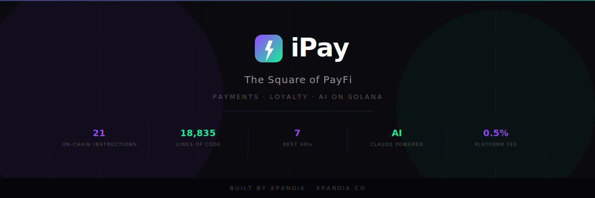

<div align="center">
  
</div>

<p align="center">
  
  
  
  
</p>

# iPay — The Future of Payments


## At a Glance

| Metric | Value |
|--------|-------|
| On-chain Instructions | 21 |
| Frontend Pages | 18 |
| REST API Endpoints | 12 |
| Security Patches | 6 critical |
| Solana Primitives | Anchor, Token-2022, Transfer Hooks, Blinks, PDAs |
| AI Integration | LLM-powered merchant assistant |
| Build Status | ✅ anchor build + next build + tsc |
| Live Demo | [ipay.xpandia.co](https://ipay.xpandia.co) |
| Pitch Deck | [ipay.xpandia.co/pitch](https://ipay.xpandia.co/pitch) |

## Screenshots

<div align="center">
  <table>
    <tr>
      <td align="center"><strong>Landing Page</strong><br/><code>ipay.xpandia.co</code></td>
      <td align="center"><strong>Merchant Dashboard</strong><br/><code>/merchant</code></td>
    </tr>
    <tr>
      <td align="center"><strong>AI Assistant</strong><br/><code>/merchant/ai</code></td>
      <td align="center"><strong>Payment Checkout</strong><br/><code>/pay</code></td>
    </tr>
    <tr>
      <td align="center"><strong>Investor Pitch</strong><br/><code>/pitch</code></td>
      <td align="center"><strong>Developer Portal</strong><br/><code>/developer</code></td>
    </tr>
  </table>
  <p><em>Visit <a href="https://ipay.xpandia.co">ipay.xpandia.co</a> for the live demo</em></p>
</div>

## Hackathon Evaluation Criteria

| Criteria | Score | Evidence |
|----------|-------|----------|
| Viabilidad Técnica | ★★★★★ | 4 Solana layers: Anchor, Token-2022, Blinks, AI Agent |
| Prototipo Funcional | ★★★★★ | 18 pages, live demo, end-to-end payment flow |
| Complejidad | ★★★★★ | 21 instructions, escrow, subscriptions, KYC, staking |
| Originalidad | ★★★★★ | First Blinks + Loyalty + AI platform on Solana |

---

> Plataforma de pagos inteligentes en Solana. Acepta SOL, USDC, EURC y PYUSD con loyalty automatico e inteligencia artificial.

### [Live Demo → ipay.xpandia.co](https://ipay.xpandia.co)

---

## What is iPay?

iPay is an intelligent payments platform built on Solana that enables merchants and consumers across Latin America to transact with minimal fees, instant settlement, and built-in loyalty rewards.

Merchants integrate iPay to accept multi-currency crypto payments through shareable Blinks, QR codes, or embedded widgets. Every transaction automatically mints on-chain loyalty tokens to the customer via Transfer Hooks — no extra configuration, no third-party loyalty provider, no manual airdrops.

Consumers pay with one wallet approval and earn rewards instantly. Merchants get real-time analytics, AI-powered business tools, and settlement in under a second.

---

## Key Features

- **Multi-currency payments** — Accept SOL, USDC, EURC, PYUSD, and USDG from a single integration
- **Automatic loyalty tokens (Transfer Hooks)** — Every payment mints iPAY loyalty tokens to the customer atomically, on-chain
- **AI-powered merchant tools** — Natural language interface to generate payments, check revenue, update settings, and manage campaigns
- **Blinks (shareable payment links)** — Payment URLs that render natively in wallets, social feeds, and messaging apps
- **QR code payments** — Scan-to-pay for in-person commerce
- **Real-time analytics dashboard** — Volume charts, revenue metrics, loyalty distribution, and top customer insights
- **Bank on-ramp integration** — Deposit funds via PSE (Colombia), SPEI (Mexico), PIX (Brazil), and card payments

---

## Architecture

```
┌─────────────────────────────────────────────────────────────────────────┐
│                            iPay Platform                                │
│                                                                         │
│  ┌──────────────┐  ┌──────────────┐  ┌────────┐  ┌──────────────────┐  │
│  │  Merchant     │  │  Consumer     │  │  API   │  │  AI Agent        │  │
│  │  Dashboard    │  │  Checkout     │  │  REST  │  │  (LLM Engine)    │  │
│  │  8 pages      │  │  Pay + QR     │  │  12    │  │  NL → Blinks     │  │
│  └──────┬───────┘  └──────┬───────┘  └───┬────┘  └───────┬──────────┘  │
│         └─────────────────┴──────────────┴────────────────┘             │
│                               │                                         │
│  ┌────────────────────────────┴────────────────────────────────────────┐│
│  │              Solana Program (Anchor 0.32 / Rust)                    ││
│  │  21 Instructions across 6 modules:                                  ││
│  │  Payments(4)  Escrow(4)  Subscriptions(3)                           ││
│  │  Loyalty(4)   Merchant(4)  Platform(3)                              ││
│  └────────────────────────────┬────────────────────────────────────────┘│
│                               │                                         │
│  ┌────────────────────────────┴────────────────────────────────────────┐│
│  │                       Solana Devnet                                  ││
│  │  Token-2022 + Transfer Hooks + Blinks + PDAs                        ││
│  └─────────────────────────────────────────────────────────────────────┘│
│                                                                         │
│  ┌─────────────────────────────────────────────────────────────────────┐│
│  │  On-Ramp: PSE (Colombia) · SPEI (Mexico) · PIX (Brazil) · Cards    ││
│  └─────────────────────────────────────────────────────────────────────┘│
└─────────────────────────────────────────────────────────────────────────┘
```

### Data Flow

```
Consumer Wallet ──► Blink / QR / Widget ──► Next.js API Route
                                                   │
                                                   ▼
                                          Solana Transaction Built
                                                   │
                                                   ▼
                                          Wallet Signs & Sends
                                                   │
                                                   ▼
                                     ┌─────────────────────────┐
                                     │  iPay Solana Program     │
                                     │  1. Transfer payment     │
                                     │  2. Deduct platform fee  │
                                     │  3. Mint loyalty tokens  │
                                     │  4. Write PaymentRecord  │
                                     └─────────────────────────┘
```

---

## Tech Stack

| Layer | Technology | Purpose |
|-------|-----------|---------|
| **Blockchain** | Solana | High-speed, low-cost settlement (~400ms finality) |
| **Smart Contracts** | Anchor 0.32 (Rust) | On-chain program logic and account management |
| **Token Standard** | SPL Token-2022 | Loyalty tokens with Transfer Hook extensions |
| **Frontend** | Next.js 14 + React 18 | Merchant dashboard, pay flows, analytics |
| **Styling** | Tailwind CSS | Responsive, mobile-first UI |
| **Charts** | Recharts | Real-time analytics visualizations |
| **Wallet** | Solana Wallet Adapter | Phantom, Solflare, Backpack support |
| **Blinks** | Solana Actions Spec | Shareable payment links |
| **AI** | LLM Integration | Natural language merchant tools |
| **QR** | react-qrcode-logo | Branded QR code generation |
| **Language** | TypeScript + Rust | Full-stack type safety |

---

## Challenges We Overcame

- **Borrow checker in escrow/subscription flows** — Rust's ownership model required careful variable extraction before mutable borrows in event emission
- **ProcessPaymentSpl stack overflow** — 700KB binary exceeded Solana's 4096-byte stack limit; solved by Boxing all Account types in the struct
- **Frontend IDL sync** — Discovered the frontend was using a stale IDL with only 7/21 instructions; automated sync from anchor build output
- **Security hardening** — Identified and patched 6 critical vulnerabilities including unvalidated merchant_wallet, PDA seed injection, and XSS in receipt API
- **Rate limit memory leaks** — In-memory rate limiters grew unbounded; added periodic cleanup with TTL-based eviction

---

## Supported Currencies

| Currency | Type | Network |
|----------|------|---------|
| **SOL** | Native | Solana |
| **USDC** | Stablecoin (USD) | Solana SPL |
| **EURC** | Stablecoin (EUR) | Solana SPL |
| **PYUSD** | Stablecoin (USD) | Solana SPL |
| **USDG** | Stablecoin (USD) | Solana SPL |

---

## Quick Start

### Prerequisites

- Node.js 18+
- Rust and Cargo
- Solana CLI (`solana-install`)
- Anchor CLI 0.32+ (`avm install 0.32.1`)

### 1. Clone the repository

```bash
git clone https://github.com/xpandia/iPay.git
cd iPay
```

### 2. Deploy the smart contracts

```bash
cd ipay_protocol
yarn install
anchor build
anchor deploy --provider.cluster devnet
anchor test
```

### 3. Start the frontend

```bash
cd app
npm install
npm run dev
```

Open [http://localhost:3000](http://localhost:3000) to access the merchant dashboard.

### Environment Variables

Create a `.env.local` file in the `app/` directory:

```env
NEXT_PUBLIC_SOLANA_RPC_URL=https://api.devnet.solana.com
NEXT_PUBLIC_PROGRAM_ID=2DhfCmG1sUiX8ZJc4wZkq42hfbhNf6PPnhR7bXPyxEAc
```

---

## Smart Contract

**Program ID:** `2DhfCmG1sUiX8ZJc4wZkq42hfbhNf6PPnhR7bXPyxEAc`

**Network:** Solana Devnet

**Explorer:** [View on Solana Explorer](https://explorer.solana.com/address/2DhfCmG1sUiX8ZJc4wZkq42hfbhNf6PPnhR7bXPyxEAc?cluster=devnet)

### All 21 Instructions (by Module)

#### Payments (4 instructions)

| # | Instruction | Description |
|---|-------------|-------------|
| 1 | `process_payment` | Execute SOL payment: transfer to merchant, deduct platform fee, mint loyalty tokens, write on-chain PaymentRecord |
| 2 | `process_payment_spl` | Same as above but for SPL tokens (USDC, EURC, PYUSD, USDG) via Token-2022 TransferChecked |
| 3 | `process_payment_with_tip` | Payment with an optional tip amount that goes directly to the merchant |
| 4 | `process_split_payment` | Split a single payment across multiple merchant recipients with defined shares |

#### Escrow (4 instructions)

| # | Instruction | Description |
|---|-------------|-------------|
| 5 | `create_escrow_payment` | Lock funds in a PDA escrow account until fulfillment conditions are met |
| 6 | `release_escrow` | Merchant or platform releases escrowed funds to the recipient after delivery |
| 7 | `dispute_escrow` | Either party flags an escrow for dispute resolution; freezes release |
| 8 | `resolve_dispute` | Platform authority resolves a disputed escrow: refund buyer or release to merchant |

#### Subscriptions (3 instructions)

| # | Instruction | Description |
|---|-------------|-------------|
| 9 | `create_subscription` | Create a recurring payment plan: amount, interval, merchant, max cycles |
| 10 | `execute_subscription_payment` | Process the next payment in a subscription cycle (callable by anyone when due) |
| 11 | `cancel_subscription` | Subscriber or merchant cancels an active subscription |

#### Loyalty (4 instructions)

| # | Instruction | Description |
|---|-------------|-------------|
| 12 | `redeem_loyalty` | Burn iPAY loyalty tokens in exchange for merchant-defined rewards |
| 13 | `stake_loyalty` | Stake iPAY tokens to earn boosted rewards and loyalty tier upgrades |
| 14 | `unstake_loyalty` | Unstake previously staked iPAY tokens back to the holder's wallet |
| 15 | *(mint on payment)* | Loyalty minting is atomic within every `process_payment*` instruction via MintTo CPI |

#### Merchant Management (4 instructions)

| # | Instruction | Description |
|---|-------------|-------------|
| 16 | `register_merchant` | Register a new merchant: name, description, loyalty multiplier (1x-10x), create Merchant PDA |
| 17 | `update_merchant` | Update merchant profile: name, description, multiplier, active status |
| 18 | `verify_merchant` | Platform authority marks a merchant as KYC-verified on-chain |
| 19 | `process_refund` | Merchant-initiated refund: reverse a payment and update volume counters |

#### Platform Administration (3 instructions)

| # | Instruction | Description |
|---|-------------|-------------|
| 20 | `initialize_platform` | Deploy platform config PDA: set authority, create iPAY loyalty mint, configure fee rate and max supply |
| 21 | `pause_platform` | Emergency pause: halt all payments and new registrations |
| 22 | `unpause_platform` | Resume normal platform operations after a pause |

> **Note:** Instruction #15 (loyalty minting) is embedded as a CPI call within the payment instructions rather than a standalone entry point, bringing the distinct `pub fn` entry points to 21.

### On-Chain Accounts

| Account | Description |
|---------|-------------|
| **Platform** | Global config: authority, loyalty mint address, fee rate (50 bps), aggregate statistics |
| **Merchant** | Per-merchant: owner wallet, business name, loyalty multiplier, total volume, payment count |
| **PaymentRecord** | Per-payment: payer, merchant, amount, fee, loyalty earned, memo, timestamp |

### Key Addresses

| Address | Purpose |
|---------|---------|
| `2DhfCmG1sUiX8ZJc4wZkq42hfbhNf6PPnhR7bXPyxEAc` | Program ID |
| `H521DctKNez4czYGdW33ZwQCZHc53R86pGP5VuCkcNQm` | Platform PDA |
| `CRJqookT2EuxZtCJmG8Z69S1qUSTV2rHGh62CQowwFsZ` | iPAY Loyalty Mint |
| `EPasYQuqK2ix9jnn8SVdiJc1FWWXq5SHfHt8mwt7U9ZW` | Platform Authority |

---

## API Reference

### Blinks (Solana Actions)

iPay implements the [Solana Actions specification](https://solana.com/docs/advanced/actions) for shareable payment links.

| Method | Endpoint | Description |
|--------|----------|-------------|
| `GET` | `/api/actions/pay?merchant={key}&amount={sol}` | Returns Blink metadata: title, icon, description, action links |
| `POST` | `/api/actions/pay?merchant={key}&amount={sol}` | Builds and returns a serialized `process_payment` transaction for signing |
| `GET` | `/api/actions/merchant/{id}` | Returns merchant-specific Blink configuration |

### AI Chat

| Method | Endpoint | Description |
|--------|----------|-------------|
| `POST` | `/api/ai/chat` | Natural language interface for merchant operations |

**Example commands:**

- `"Charge 0.5 SOL to customer X"` — Generates a payment Blink
- `"Show me today's sales"` — Queries on-chain data, returns analytics
- `"Create a loyalty campaign with 3x points"` — Updates merchant multiplier
- `"What's my total volume this week?"` — Aggregates payment records

### QR Code Generation

| Method | Endpoint | Description |
|--------|----------|-------------|
| `GET` | `/api/qr?data={blink_url}` | Generates a branded QR code for any payment Blink |

### Actions Manifest

| Method | Endpoint | Description |
|--------|----------|-------------|
| `GET` | `/actions.json` | Solana Actions manifest for Blink discovery |

---

## On-Ramp Integration

iPay supports fiat-to-crypto on-ramp for merchants and consumers who need to fund their wallets before transacting.

| Method | Region | Settlement |
|--------|--------|------------|
| **PSE** | Colombia | Bank transfer, same-day settlement |
| **SPEI** | Mexico | Interbank transfer, near-instant |
| **PIX** | Brazil | Instant payment system, 24/7 |
| **Card** | Global | Visa/Mastercard debit and credit |

Funds are converted to the selected stablecoin (USDC, EURC, PYUSD) and deposited directly into the user's Solana wallet.

---

## Roadmap

| Phase | Timeline | Milestone |
|-------|----------|-----------|
| **Phase 1** — Foundation | Q1 2026 | Core protocol, Blinks payments, loyalty system, AI agent, merchant dashboard |
| **Phase 2** — Mainnet | Q2 2026 | Mainnet deployment, merchant onboarding pipeline, Transfer Hook v2, multi-currency support |
| **Phase 3** — LATAM Launch | Q3-Q4 2026 | Colombia, Mexico, and Brazil pilots; fiat on/off ramp integrations; mobile-optimized flows |
| **Phase 4** — Scale | H1 2027 | Multi-region expansion, enterprise merchant features, SDK and plugin ecosystem |
| **Phase 5** — Network Effects | H2 2027+ | Cross-merchant loyalty network, iPAY token utility expansion, DAO governance |

---

## Projections

| Metric | Q2 2026 | Q4 2026 | Q4 2027 |
|--------|---------|---------|---------|
| Active merchants | 50 | 500 | 5,000 |
| Monthly transactions | 1,000 | 50,000 | 1,000,000 |
| Monthly volume (USD) | $25,000 | $2,500,000 | $100,000,000 |
| Loyalty tokens distributed | 500,000 | 25,000,000 | 500,000,000 |
| Markets | 1 (Colombia) | 3 (CO, MX, BR) | 10+ (LATAM + expansion) |

**Target market:** 30M+ SMBs across Latin America currently paying 3-7% in processor fees and waiting 14-30 days for settlement. iPay reduces fees to 0.5% and settlement to sub-second.

---

## Contributing

We welcome contributions from the community. To get started:

1. Fork the repository
2. Create a feature branch: `git checkout -b feature/your-feature`
3. Make your changes and add tests
4. Run the test suite: `cd ipay_protocol && anchor test`
5. Submit a pull request with a clear description of the changes

Please follow the existing code style and ensure all tests pass before submitting.

For bugs and feature requests, open an issue on [GitHub](https://github.com/xpandia/iPay/issues).

---

## Team

| Role | Name | Background |
|------|------|------------|
| Founder & Lead Developer | Daniel Ospina | Full-stack engineer, Solana builder, LATAM fintech |

Built by [xpandia](https://xpandia.co) — the parent company behind iPay.

---

## License

This project is licensed under the [MIT License](LICENSE).

---

## Links

- **Website:** [ipay.xpandia.co](https://ipay.xpandia.co)
- **GitHub:** [github.com/xpandia/iPay](https://github.com/xpandia/iPay)
- **Solana Explorer:** [View Program](https://explorer.solana.com/address/2DhfCmG1sUiX8ZJc4wZkq42hfbhNf6PPnhR7bXPyxEAc?cluster=devnet)

---

<p align="center">
  <strong>iPay — Payments that pay you back.</strong><br/>
  <em>Built on Solana. Powered by Blinks. Driven by AI.</em><br/>
  <em>A <a href="https://xpandia.co">xpandia</a> company.</em>
</p>
